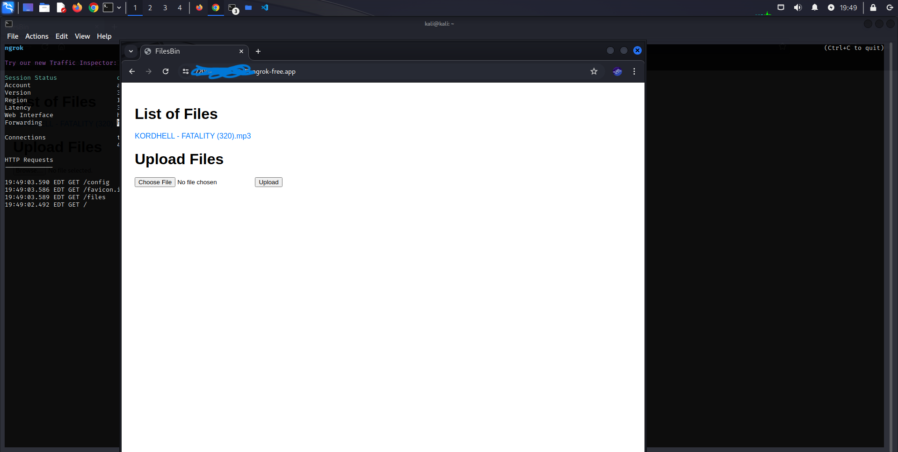

# FileHostingWebServer
Files Hosting webserver using ngrok

<h1> Description </h1>
Basic webpage made for hosting files and accessing them from any part of the globe, with the help on ngrok, could be also used for sharing files with friends on the fly!
using python-flask, html/js , gunicorn, and ngrok. easy to use just follow the instructions!

<h1>installation</h1>
First make sure that you have:
<ul>
  <li>ngrok</li>
  <li>flask</li>
  <li>gunicorn</li>
</ul>

to install them first:
<h2>NGROK INSTALLATION: </h2>
make sure you're in the /Downloads directory
<li style="background-color:tomato> " wget https://bin.equinox.io/c/bNyj1mQVY4c/ngrok-v3-stable-linux-amd64.tgz "</li>
<li style="background-color:tomato> "tar zxvf /path/to/ngrok.tgz"</li>
<li style="background-color:tomato> "./ngrok authtoken [your_auth_token]"</li>
<b> TO GET YOUR TOKEN GO TO NGROK.COM AND REGISTER...</b>

<a href="https://www.youtube.com/watch?v=LYmhwKVNjk4&ab_channel=TECHDHEE">Here is a youtube guide</a>

<h2>FLASK INSTALLATION: </h2>
<li style="background-color:tomato>" pip install Flask "</li>

<h2>GUNICORN INSTALLATION: </h2>
<li style="background-color:tomato>" pip install gunicorn "</li>

<h1>After that you've installed everything we'll start with the server</h1>
<li> put "app.py" and "/templates/" and "/uploads/" and "/instance/" in var/www/html/ </li>
your /var/www/html/ should look like this 

<li>open a terminal in the same directory</li>
<li style="background-color:tomato>" sudo python app.py "</li>
<li>then open a new terminal in the same directory and run </li>
<li style="background-color:tomato>" python3 -m gunicorn -w 4 -b 127.0.0.1:8080 app:app "</li>
<li style="background-color:tomato>r"ngrok http 5000"</li>
<li>in a new terminal that can be in any directory"</li>
it should look something like this 

NGROK will give you a url you can share it with friends from anywhere to share files!
all the uploads will be saved in /var/www/html/uploads/
you might need to run 
<li style="background-color:tomato>"sudo chmod -R 755 /var/www/html" </li>
if the you get a premission error
once you've done all the steps you should have something like this 

For any help join my discord server 
<a href="https://discord.gg/587R6vqK8w">JOIN SERVER!</a>
